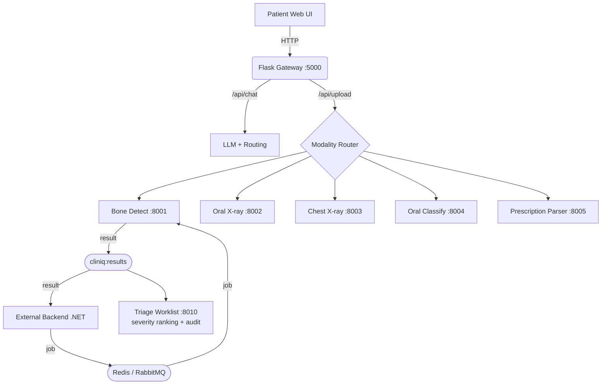

# ClinIQ AI Platform

ClinIQ is a bilingual medical AI assistant designed to simplify healthcare. It enables patients to upload scans and receive AI-powered, easy-to-understand medical insights.

---

## 📖 Why This Repo Matters

ClinIQ AI is not a single-model demo - it is a **complete, production-oriented AI stack**:

* Conversational triage in **Arabic & English**
* Multi-modal medical uploads (X-rays, images, PDFs)
* Specialized AI services (bone, dental, chest, prescriptions)
* Structured **LLM-ready JSON outputs**
* Visual explainability (GradCAM + annotated outputs)

---

## 🗺️ Monorepo Structure

| Module                | Purpose                                     | Status        |
| --------------------- | ------------------------------------------- | ------------- |
| `chatbot-app`         | Patient-facing assistant (Flask + JS UI)    | 🟢 Active     |
| `bone-detect`         | Pediatric wrist fracture detection (YOLO)   | 🟢 Active     |
| `oral-xray`           | Dental panoramic pipeline (YOLO + ConvNeXt) | 🟢 Active     |
| `oral-classify`       | Intraoral classification + GradCAM          | 🟢 Active     |
| `chest_xray`          | Thoracic disease classification + GradCAM   | 🟢 Active     |
| `prescription-parser` | VLM-based handwritten parsing (Qwen2-VL)    | 🆕 New        |
| `prescription_ocr`    | OCR/NLP legacy pipeline                     | 🟡 Maintained |
| `messaging`           | Pluggable Redis/RabbitMQ async job queue    | 🆕 New        |
| `triage`              | Severity worklist + prediction audit trail  | 🆕 New        |

> 🚀 **New here? Start with [SETUP.md](SETUP.md)** — a step-by-step fresh-clone → running-platform guide.

---

## ✨ Major Features

### 🧑‍⚕️ Real Patient Interface

* Persistent chat memory (SQLite per patient)
* Full conversation management (create / switch / delete)
* Guided + manual scan upload flows
* Upload progress tracking with live status
* Annotated medical outputs inside chat
* Appointment booking with queue tracking
* Chat export + copy features

---

### 🌍 AR / EN Smart Localization

* Runtime UI translation system (i18n)
* Instant language switching (AR / EN)
* Language-aware quick prompts
* Backend language resolution logic
* Strict single-language responses (no mixing)

---

### 🔌 Medical AI Service Integration

* Automatic routing based on scan modality
* Unified response schema across services
* Dedicated prescription parsing API

---

### 📨 Async Job Queue + Triage Worklist + Audit Trail

* **Pluggable broker** (`messaging/`): Redis Streams or RabbitMQ, chosen by
  `QUEUE_BACKEND` (opt-in — services stay HTTP-only when unset)
* **Every service is also a worker**: consumes `cliniq:jobs:<modality>`, publishes
  to `cliniq:results` — lets an external backend (e.g. .NET) submit jobs async
* **Triage worklist** (`triage/`, port 8010): ranks cases by severity so critical
  findings surface first (inspired by Aidoc/Qure.ai triage)
* **Audit trail**: every prediction logged with its **model version** + input
  **sha256** for full traceability
* See [docs/QUEUE_INTEGRATION.md](docs/QUEUE_INTEGRATION.md) (backend contract +
  C# examples) and [triage/README.md](triage/README.md)

---

## 🧠 Inference Services

### Bone Detection

* YOLO-based pediatric fracture detection
* 16-bit X-ray normalization
* Structured detections + annotated output

### Oral X-ray

* Two-stage pipeline (YOLO + ConvNeXt)
* Severity scoring + refined detections

### Oral Classification

* Image classifier with GradCAM overlays
* LLM-ready output format

### Chest X-ray

* Multi-label disease classification
* GradCAM explainability

### Prescription Parser

* Qwen2-VL powered VLM
* Strict JSON extraction
* Egyptian drug normalization (RapidFuzz)

---

## 🏗️ System Architecture



---

## 🔌 Service Ports

| Service             | Port | Endpoint                                |
| ------------------- | ---- | --------------------------------------- |
| chatbot-app         | 5000 | `/api/chat`, `/api/upload`              |
| bone-detect         | 8001 | `/predict_for_llm`                      |
| oral-xray           | 8002 | `/predict_for_llm`                      |
| chest_xray          | 8003 | `/predict_for_llm`                      |
| oral-classify       | 8004 | `/predict_for_llm`                      |
| prescription-parser | 8005 | `/predict_for_llm`, `/parse`, `/status` |
| triage worklist     | 8010 | `/`, `/worklist`, `/audit/stats`        |

---

## 💾 Model Artifacts

📦 Stored externally (Google Drive):

[https://drive.google.com/open?id=1sqt6QCXp_3UmJrEmM8b9Fu0CRC4f9cb2](https://drive.google.com/open?id=1sqt6QCXp_3UmJrEmM8b9Fu0CRC4f9cb2)

---

## 📸 UI Preview

| Chat                                                                                                    | Language                                                                                                |
| ------------------------------------------------------------------------------------------------------- | ------------------------------------------------------------------------------------------------------- |
|  |  |

| Upload                                                                                                  | Progress                                                                                                |
| ------------------------------------------------------------------------------------------------------- | ------------------------------------------------------------------------------------------------------- |
|  |  |

---

## 🤖 Model Outputs

| Dental                                                                                                  | Bone                                                                                                    |
| ------------------------------------------------------------------------------------------------------- | ------------------------------------------------------------------------------------------------------- |
|  |  |

---

## 🚀 Run Locally

### Requirements

* Linux + CUDA GPU (recommended)
* Conda env (`cliniq`)
* Installed dependencies
* LLM API key

### Start Services

```bash
cd bone-detect && python api/server.py
cd oral-xray && python api/server.py
cd chest_xray && python api/server.py
cd oral-classify && python api/server.py
cd prescription-parser && python api/server.py
cd chatbot-app && python app.py
```

👉 [http://127.0.0.1:5000](http://127.0.0.1:5000)

**Optional — async queue + triage worklist:**

```bash
export QUEUE_BACKEND=redis
export REDIS_CONNECTION='your-host:6379,password=YOUR_TOKEN,ssl=true'
# restart the services above (each now also consumes its job queue), then:
cd triage && python app.py        # http://localhost:8010
```

Full step-by-step setup: [SETUP.md](SETUP.md).

---

## 💻 API Examples

### Chat

```bash
curl -X POST http://127.0.0.1:5000/api/chat \\
  -H "Content-Type: application/json" \\
  -d '{"message":"I want to book an appointment","patient_id":"patient_demo","language_preference":"en"}'
```

### Upload

```bash
curl -X POST http://127.0.0.1:5000/api/upload \\
  -F "file=@/path/to/image.jpg" \\
  -F "patient_id=patient_demo" \\
  -F "image_type=dental_xray"
```
