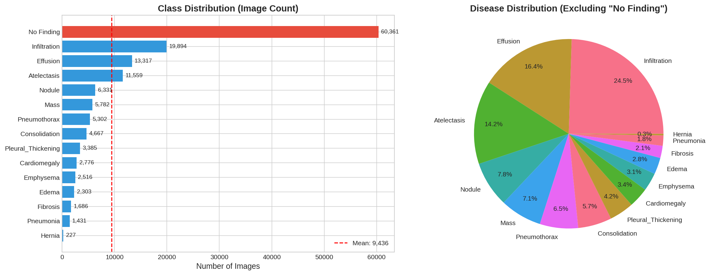
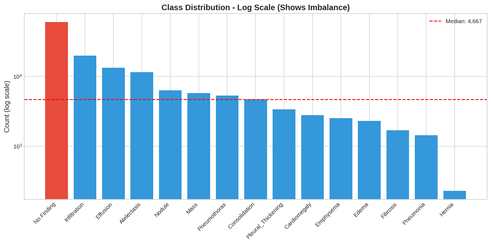
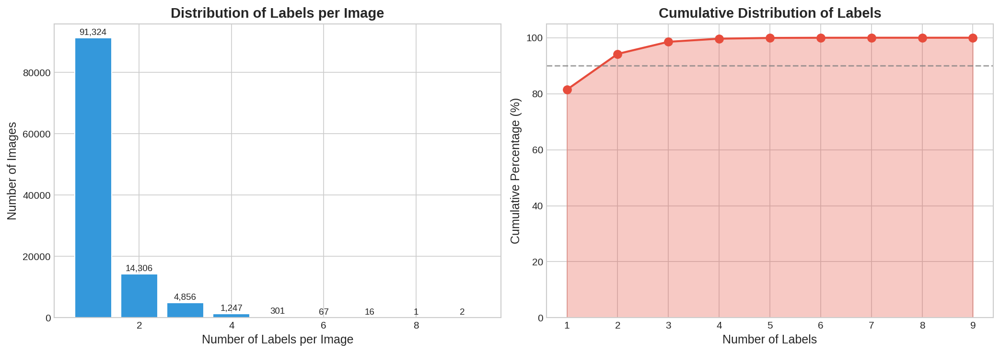
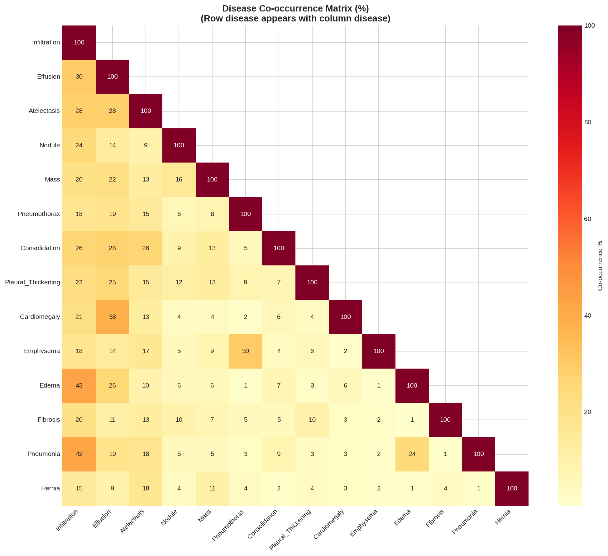
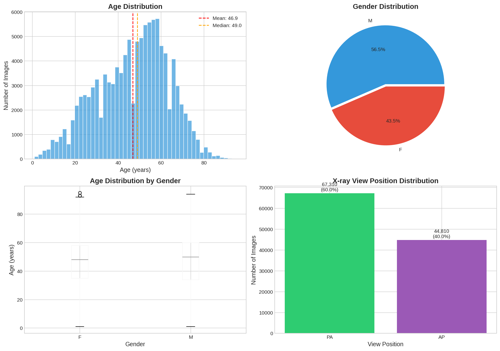
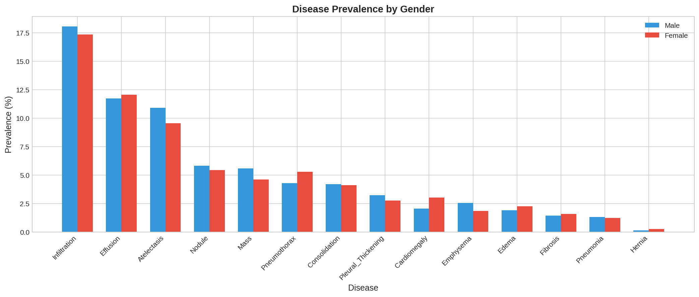
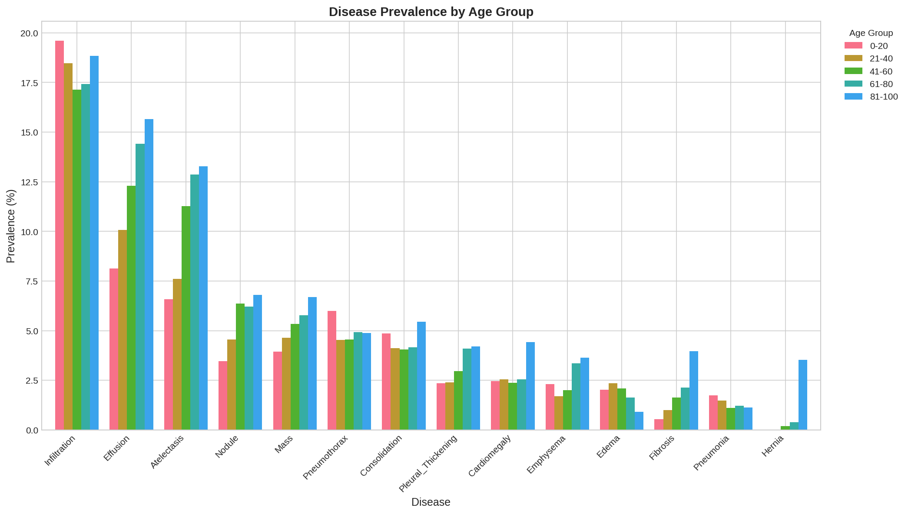
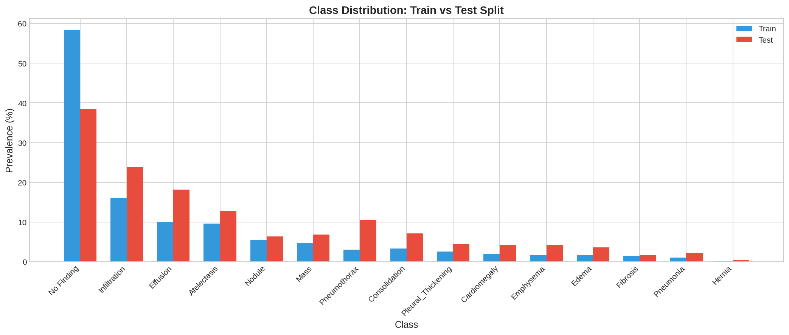
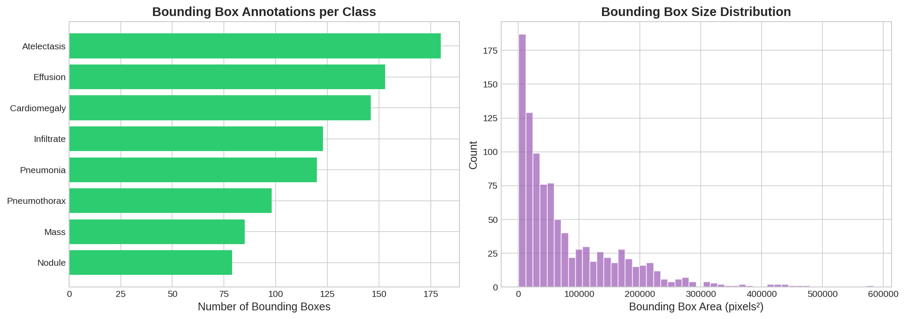
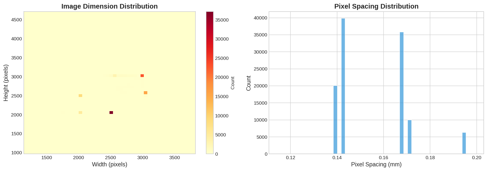

# 🫁 NIH Chest X-ray14 Dataset - EDA Report

**Dataset**: NIH Clinical Center Chest X-ray Dataset  
**Images**: 112,120 frontal-view X-ray images  
**Patients**: 30,805 unique patients  
**Classes**: 14 diseases + "No Finding"  

---

## 📊 Dataset Overview

| Metric | Value |
|--------|-------|
| **Total Images** | 112,120 |
| **Unique Patients** | 30,805 |
| **Train Set** | 86,524 (77.2%) |
| **Test Set** | 25,596 (22.8%) |
| **Image Dimensions** | ~2518 × 2544 pixels |
| **Multi-label Images** | 20,796 (18.5%) |

---

## 📋 Class Distribution



### Disease Counts

| Class | Count | Percentage |
|-------|-------|------------|
| **No Finding** | 60,361 | 53.84% |
| Infiltration | 19,894 | 17.74% |
| Effusion | 13,317 | 11.88% |
| Atelectasis | 11,559 | 10.31% |
| Nodule | 6,331 | 5.65% |
| Mass | 5,782 | 5.16% |
| Pneumothorax | 5,302 | 4.73% |
| Consolidation | 4,667 | 4.16% |
| Pleural_Thickening | 3,385 | 3.02% |
| Cardiomegaly | 2,776 | 2.48% |
| Emphysema | 2,516 | 2.24% |
| Edema | 2,303 | 2.05% |
| Fibrosis | 1,686 | 1.50% |
| Pneumonia | 1,431 | 1.28% |
| Hernia | 227 | 0.20% |

> [!WARNING]
> **Severe Class Imbalance**: Ratio of 266:1 between "No Finding" and "Hernia"

---

## ⚖️ Class Imbalance Analysis



**Key Observations**:
- "No Finding" dominates with 54% of all images
- Hernia is extremely rare (only 227 cases)
- Top 4 classes account for 93% of disease labels

> [!TIP]
> **Recommendation**: Use weighted loss functions or focal loss to handle imbalance

---

## 🏷️ Multi-Label Analysis



### Labels per Image Distribution

| # Labels | Images | Percentage |
|----------|--------|------------|
| 1 label | 91,324 | 81.5% |
| 2 labels | 14,306 | 12.8% |
| 3 labels | 4,856 | 4.3% |
| 4 labels | 1,247 | 1.1% |
| 5+ labels | 387 | 0.4% |

**Statistics**:
- Mean labels per image: **1.26**
- Maximum labels: **9** (in 2 images)

> [!IMPORTANT]
> This is a **multi-label classification** problem - images can have multiple diseases simultaneously

---

## 🔗 Disease Co-occurrence



### Top 10 Disease Combinations

| Disease Pair | Count |
|--------------|-------|
| Infiltration + Effusion | 4,000 |
| Effusion + Atelectasis | 3,275 |
| Infiltration + Atelectasis | 3,264 |
| Infiltration + Nodule | 1,546 |
| Effusion + Consolidation | 1,287 |
| Effusion + Mass | 1,254 |
| Atelectasis + Consolidation | 1,223 |
| Infiltration + Consolidation | 1,221 |
| Infiltration + Mass | 1,159 |
| Effusion + Cardiomegaly | 1,063 |

**Insights**:
- Infiltration frequently co-occurs with other diseases
- Edema shows 43% co-occurrence with Infiltration
- Pneumonia shows 42% co-occurrence with Infiltration

---

## 👤 Patient Demographics



### Age Distribution
- **Mean**: 46.9 years
- **Median**: 49.0 years
- **Range**: 1 - 95 years
- **Std Dev**: 16.6 years

### Gender Distribution
| Gender | Count | Percentage |
|--------|-------|------------|
| Male | 63,340 | 56.5% |
| Female | 48,780 | 43.5% |

### View Position
| Position | Count | Percentage |
|----------|-------|------------|
| PA (Posterior-Anterior) | 67,310 | 60.0% |
| AP (Anterior-Posterior) | 44,810 | 40.0% |

---

## 📊 Disease Prevalence by Demographics

### By Gender


### By Age Group


**Key Observations**:
- Effusion and Atelectasis prevalence increases with age
- Hernia shows higher prevalence in elderly (81-100)
- Most diseases peak in 61-80 age group

---

## 📁 Train/Test Split



| Split | Images | Percentage |
|-------|--------|------------|
| Train/Val | 86,524 | 77.2% |
| Test | 25,596 | 22.8% |

> [!NOTE]
> Class distributions are consistent between train and test sets

---

## 📦 Bounding Box Analysis



| Metric | Value |
|--------|-------|
| **Total Annotations** | 984 |
| **Images with BBox** | 880 |
| **Coverage** | 0.88% of images |

### BBox per Disease

| Disease | BBox Count |
|---------|------------|
| Atelectasis | 180 |
| Effusion | 153 |
| Cardiomegaly | 146 |
| Infiltrate | 123 |
| Pneumonia | 120 |
| Pneumothorax | 98 |
| Mass | 85 |
| Nodule | 79 |

> [!CAUTION]
> **Not Suitable for YOLO**: Only 0.88% of images have bounding boxes - insufficient for object detection training

---

## 🖼️ Image Properties



| Property | Mean | Range |
|----------|------|-------|
| **Width** | 2,646 px | 1,143 - 3,827 |
| **Height** | 2,486 px | 966 - 4,715 |
| **Pixel Spacing** | 0.14 mm | Variable |

---

## 💡 Key Insights & Recommendations

### 📌 Summary of Findings

| Finding | Details |
|---------|---------|
| **Task Type** | Multi-label Classification |
| **Class Imbalance** | Severe (266:1 ratio) |
| **Multi-label Rate** | 18.5% of images |
| **YOLO Applicable** | ❌ No (insufficient bboxes) |

### 🎯 Recommended Approach

```
✅ Classification (NOT YOLO)
✅ Multi-label output (Sigmoid activation)
✅ Weighted BCE or Focal Loss
✅ AUC-ROC as primary metric
```

### 📋 Suggested Models

1. **DenseNet-121** - CheXNet architecture (state-of-the-art)
2. **ConvNeXt** - Modern architecture with strong results
3. **EfficientNet** - Good accuracy/efficiency tradeoff
4. **Vision Transformers** - ViT, Swin for best performance

### ⚙️ Training Configuration

```yaml
# Recommended settings
loss: BCEWithLogitsLoss (weighted)
optimizer: AdamW
lr: 0.0001
weight_decay: 0.00001
scheduler: CosineAnnealing
batch_size: 32
image_size: 224
epochs: 50
early_stopping: patience=10
```

### 🔧 Handling Class Imbalance

1. **Weighted Loss**: Apply inverse frequency weights
2. **Focal Loss**: γ=2.0, α=0.25
3. **Oversampling**: Minority class augmentation
4. **Data Augmentation**: Heavy augmentation for rare classes

---

## 📚 References

- **Dataset**: [NIH Chest X-ray14](https://www.nih.gov/news-events/news-releases/nih-clinical-center-provides-one-largest-publicly-available-chest-x-ray-datasets-scientific-community)
- **Paper**: Wang et al., "ChestX-ray8: Hospital-scale Chest X-ray Database and Benchmarks" (2017)
- **CheXNet**: Rajpurkar et al., "CheXNet: Radiologist-Level Pneumonia Detection on Chest X-Rays" (2017)

---

*Generated on: February 4, 2026*
